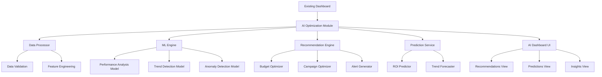
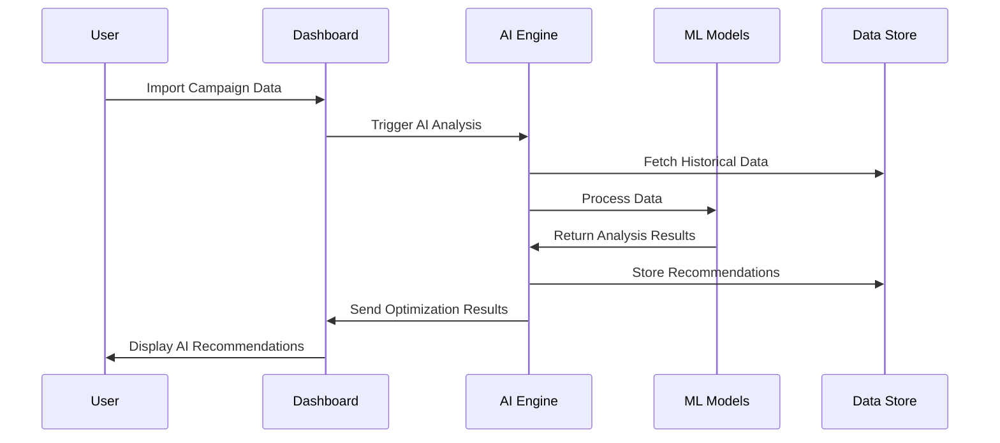

# Design Document

## Overview

ระบบ AI-Powered Campaign Optimization จะเป็นส่วนขยายของ Affilitics.me Dashboard ที่มีอยู่ โดยเพิ่มความสามารถในการวิเคราะห์และแนะนำการปรับปรุง Campaign อัตโนมัติผ่าน Machine Learning algorithms

ระบบจะประกอบด้วย AI Analysis Engine, Prediction Models, Recommendation System และ User Interface ที่ผสานเข้ากับ Dashboard เดิมอย่างลงตัว

## Architecture

### High-Level Architecture



### Data Flow Architecture



## Components and Interfaces

### 1. AI Analysis Engine (`src/services/aiAnalysisEngine.ts`)

**Purpose:** หลักในการประมวลผลข้อมูลและควบคุม ML models

**Key Methods:**
```typescript
interface AIAnalysisEngine {
  analyzePerformance(data: CampaignData): Promise<PerformanceAnalysis>
  generateRecommendations(analysis: PerformanceAnalysis): Promise<Recommendation[]>
  predictROI(data: CampaignData, timeframe: number): Promise<ROIPrediction>
  detectAnomalies(data: CampaignData): Promise<Anomaly[]>
  optimizeBudget(constraints: BudgetConstraints): Promise<BudgetOptimization>
}
```

### 2. Machine Learning Models (`src/ml/`)

**Performance Analysis Model (`performanceModel.ts`):**
- วิเคราะห์ประสิทธิภาพของแต่ละ Sub ID และแพลตฟอร์ม
- ใช้ Random Forest หรือ Gradient Boosting สำหรับการจำแนกประเภท

**Trend Detection Model (`trendModel.ts`):**
- ตรวจจับแนวโน้มและรูปแบบในข้อมูล
- ใช้ Time Series Analysis และ LSTM networks

**Anomaly Detection Model (`anomalyModel.ts`):**
- ตรวจจับความผิดปกติในประสิทธิภาพ Campaign
- ใช้ Isolation Forest หรือ One-Class SVM

### 3. Recommendation Engine (`src/services/recommendationEngine.ts`)

**Purpose:** สร้างคำแนะนำที่เป็นประโยชน์จากผลการวิเคราะห์

**Key Features:**
- Budget reallocation recommendations
- Sub ID optimization suggestions
- Platform-specific improvements
- Creative and targeting recommendations

### 4. Prediction Service (`src/services/predictionService.ts`)

**Purpose:** ทำนายประสิทธิภาพในอนาคตและแนวโน้ม

**Key Methods:**
```typescript
interface PredictionService {
  predictROI(data: CampaignData, days: number): Promise<ROIPrediction>
  forecastTrends(data: CampaignData): Promise<TrendForecast>
  calculateConfidenceIntervals(prediction: Prediction): ConfidenceInterval
  assessRisk(prediction: Prediction): RiskAssessment
}
```

### 5. AI Dashboard Components

**AIOptimizationDashboard (`src/components/AIOptimizationDashboard.tsx`):**
- หน้าหลักสำหรับแสดงผล AI insights
- รวม recommendations, predictions และ alerts

**RecommendationCard (`src/components/RecommendationCard.tsx`):**
- แสดงคำแนะนำแต่ละรายการพร้อม confidence score
- ปุ่มสำหรับ implement หรือ dismiss recommendation

**PredictionChart (`src/components/PredictionChart.tsx`):**
- กราฟแสดงการทำนาย ROI และแนวโน้ม
- รวม confidence intervals และ risk indicators

**AlertPanel (`src/components/AlertPanel.tsx`):**
- แสดงการแจ้งเตือนจาก AI system
- จัดลำดับตามความสำคัญและความเร่งด่วน

## Data Models

### AI Analysis Data Models

```typescript
interface CampaignData {
  shopeeOrders: ShopeeOrder[]
  lazadaOrders: LazadaOrder[]
  facebookAds: FacebookAd[]
  dateRange: DateRange
  subIds: string[]
}

interface PerformanceAnalysis {
  overallScore: number
  subIdPerformance: SubIdAnalysis[]
  platformPerformance: PlatformAnalysis[]
  trends: TrendAnalysis[]
  anomalies: Anomaly[]
}

interface Recommendation {
  id: string
  type: 'budget' | 'targeting' | 'creative' | 'platform'
  title: string
  description: string
  expectedImpact: number
  confidenceScore: number
  priority: 'high' | 'medium' | 'low'
  actionItems: ActionItem[]
  estimatedROIImprovement: number
}

interface ROIPrediction {
  predictedROI: number
  confidenceInterval: {
    lower: number
    upper: number
  }
  riskLevel: 'low' | 'medium' | 'high'
  factors: PredictionFactor[]
  timeframe: number
}

interface BudgetOptimization {
  currentAllocation: BudgetAllocation[]
  recommendedAllocation: BudgetAllocation[]
  expectedImprovement: number
  riskAssessment: string
  justification: string[]
}
```

### ML Model Data Structures

```typescript
interface MLModelConfig {
  modelType: 'randomForest' | 'gradientBoosting' | 'lstm' | 'isolationForest'
  hyperparameters: Record<string, any>
  trainingData: TrainingDataset
  validationMetrics: ValidationMetrics
}

interface TrainingDataset {
  features: number[][]
  labels: number[]
  featureNames: string[]
  datasetSize: number
}
```

## Error Handling

### AI Analysis Errors

1. **Insufficient Data Error:**
   - เมื่อข้อมูลไม่เพียงพอสำหรับการวิเคราะห์
   - แสดงข้อความแนะนำให้ import ข้อมูลเพิ่มเติม

2. **Model Loading Error:**
   - เมื่อ ML models ไม่สามารถโหลดได้
   - Fallback ไปใช้ basic statistical analysis

3. **Prediction Confidence Error:**
   - เมื่อความแม่นยำของการทำนายต่ำกว่าเกณฑ์
   - แสดงคำเตือนและลดความเชื่อมั่นในผลลัพธ์

### Data Quality Issues

1. **Data Validation:**
   - ตรวจสอบความถูกต้องของข้อมูลก่อนการวิเคราะห์
   - แจ้งเตือนเมื่อพบข้อมูลที่ผิดปกติ

2. **Missing Data Handling:**
   - ใช้ interpolation หรือ imputation สำหรับข้อมูลที่ขาดหาย
   - แจ้งผู้ใช้เกี่ยวกับข้อมูลที่ถูกประมาณ

## Testing Strategy

### Unit Testing

1. **ML Model Testing:**
   - ทดสอบความแม่นยำของแต่ละ model
   - Validate prediction accuracy กับ test dataset

2. **Component Testing:**
   - ทดสอบ AI dashboard components
   - Mock AI service responses สำหรับการทดสอบ

### Integration Testing

1. **Data Pipeline Testing:**
   - ทดสอบการไหลของข้อมูลจาก import ไปยัง AI analysis
   - ทดสอบการเชื่อมต่อระหว่าง components

2. **End-to-End Testing:**
   - ทดสอบ user journey ตั้งแต่ import ข้อมูลจนถึงการแสดงผล recommendations
   - ทดสอบ performance กับข้อมูลจริง

### Performance Testing

1. **ML Model Performance:**
   - ทดสอบเวลาในการประมวลผลของแต่ละ model
   - Optimize สำหรับข้อมูลขนาดใหญ่

2. **UI Responsiveness:**
   - ทดสอบการตอบสนองของ AI dashboard
   - ทดสอบการแสดงผลเมื่อมีข้อมูลมาก

### Model Validation

1. **Cross-Validation:**
   - ใช้ k-fold cross-validation สำหรับ model evaluation
   - ทดสอบกับข้อมูลจากช่วงเวลาต่างๆ

2. **A/B Testing Framework:**
   - เปรียบเทียบประสิทธิภาพของ recommendations
   - ติดตาม actual vs predicted outcomes

## Implementation Considerations

### Performance Optimization

1. **Lazy Loading:**
   - โหลด ML models เมื่อจำเป็นเท่านั้น
   - Cache ผลการวิเคราะห์เพื่อลดการประมวลผลซ้ำ

2. **Background Processing:**
   - ประมวลผล AI analysis ใน background
   - แสดง loading states และ progress indicators

### Scalability

1. **Model Management:**
   - ระบบสำหรับ update และ version control ของ ML models
   - Support สำหรับ multiple model versions

2. **Data Storage:**
   - Efficient storage สำหรับ training data และ model artifacts
   - Data retention policies สำหรับ historical analysis

### Security and Privacy

1. **Data Protection:**
   - Encrypt sensitive campaign data
   - Implement data anonymization สำหรับ model training

2. **Model Security:**
   - Protect ML models จาก reverse engineering
   - Validate input data เพื่อป้องกัน adversarial attacks