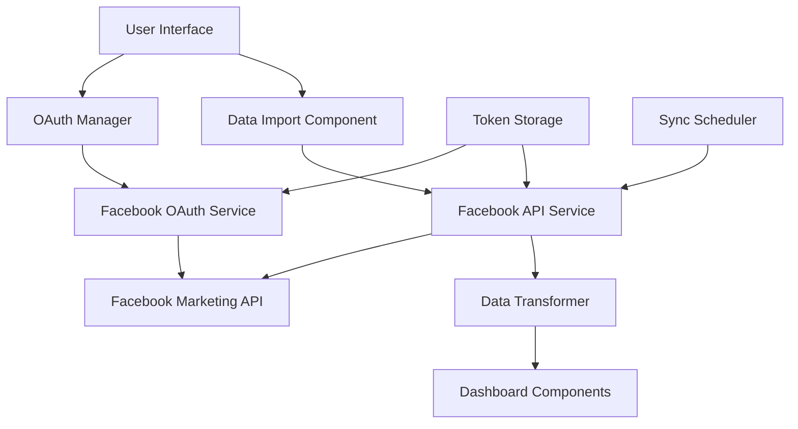
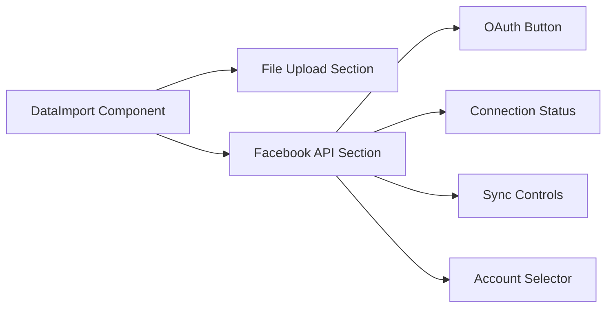

# Design Document

## Overview

The Facebook API integration feature extends the existing data import functionality by providing users with an alternative to manual file uploads. Users can authenticate with Facebook through OAuth 2.0 and automatically sync their advertising data directly from the Facebook Marketing API. This integration maintains compatibility with the existing dashboard components while adding real-time data synchronization capabilities.

The design follows the existing architecture patterns in the application, utilizing React hooks for state management, TypeScript for type safety, and the current UI component library for consistent user experience.

## Architecture

### High-Level Architecture



### Component Architecture

The integration will extend the existing `DataImport.tsx` component with new Facebook API functionality while maintaining backward compatibility with file uploads.



## Components and Interfaces

### 1. Facebook OAuth Service

**Purpose**: Handles Facebook OAuth 2.0 authentication flow

**Interface**:
```typescript
interface FacebookOAuthService {
  initiateAuth(): Promise<void>;
  handleAuthCallback(code: string): Promise<FacebookTokens>;
  refreshToken(refreshToken: string): Promise<FacebookTokens>;
  revokeToken(accessToken: string): Promise<void>;
  isAuthenticated(): boolean;
}

interface FacebookTokens {
  accessToken: string;
  refreshToken?: string;
  expiresIn: number;
  tokenType: string;
  scope: string[];
}
```

**Implementation Details**:
- Uses popup window for OAuth flow to avoid page redirects
- Implements PKCE (Proof Key for Code Exchange) for security
- Handles token refresh automatically
- Stores tokens securely in localStorage with encryption

### 2. Facebook API Service

**Purpose**: Interfaces with Facebook Marketing API to fetch advertising data

**Interface**:
```typescript
interface FacebookAPIService {
  getAdAccounts(): Promise<FacebookAdAccount[]>;
  getCampaigns(accountId: string, dateRange?: DateRange): Promise<FacebookCampaign[]>;
  getAdSets(campaignId: string): Promise<FacebookAdSet[]>;
  getAds(adSetId: string): Promise<FacebookAd[]>;
  getInsights(objectId: string, level: InsightLevel, metrics: string[]): Promise<FacebookInsights>;
  syncAllData(accountIds: string[]): Promise<FacebookSyncResult>;
}

interface FacebookAdAccount {
  id: string;
  name: string;
  currency: string;
  timezone: string;
  accountStatus: string;
}

interface FacebookSyncResult {
  campaigns: FacebookCampaign[];
  totalSpend: number;
  totalImpressions: number;
  totalClicks: number;
  syncTimestamp: Date;
  errors: string[];
}
```

**Implementation Details**:
- Implements rate limiting and retry logic
- Supports batch requests for efficiency
- Handles API versioning (currently v19.0)
- Implements circuit breaker pattern for reliability

### 3. Data Transformer

**Purpose**: Converts Facebook API data to match existing dashboard data structure

**Interface**:
```typescript
interface DataTransformer {
  transformFacebookData(facebookData: FacebookSyncResult): TransformedData;
  mergeFacebookWithExisting(facebookData: any[], existingData: any[]): any[];
  validateDataStructure(data: any[]): ValidationResult;
}

interface TransformedData {
  campaigns: CampaignData[];
  ads: AdData[];
  insights: InsightData[];
  metadata: DataMetadata;
}
```

**Implementation Details**:
- Maps Facebook campaign structure to existing data schema
- Handles currency conversion if needed
- Preserves data lineage for debugging
- Implements data validation and sanitization

### 4. Enhanced DataImport Component

**Purpose**: Extended UI component supporting both file upload and API integration

**New Props**:
```typescript
interface DataImportProps {
  // Existing props...
  onDataImported: (data: any) => void;
  onNavigateToDashboard?: () => void;
  storedData?: StoredDataState;
  onStoredDataUpdate?: (data: StoredDataState) => void;
  
  // New props for Facebook API
  facebookConnection?: FacebookConnectionState;
  onFacebookConnectionChange?: (state: FacebookConnectionState) => void;
}

interface FacebookConnectionState {
  isConnected: boolean;
  connectedAccounts: FacebookAdAccount[];
  lastSyncTime?: Date;
  syncStatus: 'idle' | 'syncing' | 'error';
  error?: string;
}
```

### 5. OAuth Popup Manager

**Purpose**: Manages OAuth popup window and communication

**Interface**:
```typescript
interface OAuthPopupManager {
  openPopup(authUrl: string): Promise<string>;
  closePopup(): void;
  handleMessage(event: MessageEvent): void;
}
```

**Implementation Details**:
- Creates centered popup window
- Handles cross-origin communication
- Implements timeout handling
- Manages popup lifecycle

## Data Models

### Facebook API Data Models

```typescript
interface FacebookCampaign {
  id: string;
  name: string;
  status: 'ACTIVE' | 'PAUSED' | 'DELETED' | 'ARCHIVED';
  objective: string;
  created_time: string;
  updated_time: string;
  account_id: string;
  daily_budget?: number;
  lifetime_budget?: number;
  insights?: FacebookInsights;
}

interface FacebookInsights {
  impressions: number;
  clicks: number;
  spend: number;
  reach: number;
  frequency: number;
  cpm: number;
  cpc: number;
  ctr: number;
  date_start: string;
  date_stop: string;
}

interface FacebookAd {
  id: string;
  name: string;
  status: string;
  campaign_id: string;
  adset_id: string;
  creative: {
    id: string;
    title: string;
    body: string;
    image_url?: string;
  };
  insights?: FacebookInsights;
}
```

### Storage Models

```typescript
interface FacebookConnectionData {
  tokens: FacebookTokens;
  connectedAccounts: FacebookAdAccount[];
  preferences: {
    autoSync: boolean;
    syncInterval: number; // minutes
    selectedAccounts: string[];
  };
  lastSync: Date;
}

interface SyncHistory {
  id: string;
  timestamp: Date;
  status: 'success' | 'partial' | 'failed';
  recordsProcessed: number;
  errors: string[];
  duration: number; // milliseconds
}
```

## Error Handling

### Error Categories

1. **Authentication Errors**
   - Invalid credentials
   - Expired tokens
   - Insufficient permissions
   - OAuth flow cancellation

2. **API Errors**
   - Rate limiting
   - Network timeouts
   - Invalid requests
   - Service unavailable

3. **Data Processing Errors**
   - Invalid data format
   - Transformation failures
   - Validation errors
   - Storage failures

### Error Handling Strategy

```typescript
interface ErrorHandler {
  handleAuthError(error: AuthError): Promise<void>;
  handleAPIError(error: APIError): Promise<void>;
  handleDataError(error: DataError): Promise<void>;
  shouldRetry(error: Error): boolean;
  getRetryDelay(attempt: number): number;
}

class FacebookErrorHandler implements ErrorHandler {
  // Implements exponential backoff
  // Handles specific Facebook API error codes
  // Provides user-friendly error messages
  // Logs errors for debugging
}
```

## Testing Strategy

### Unit Testing

1. **Service Layer Tests**
   - OAuth flow simulation
   - API request/response handling
   - Data transformation logic
   - Error handling scenarios

2. **Component Tests**
   - UI interaction testing
   - State management verification
   - Props handling validation
   - Event handling confirmation

### Integration Testing

1. **OAuth Flow Testing**
   - End-to-end authentication
   - Token refresh scenarios
   - Error handling validation
   - Cross-browser compatibility

2. **API Integration Testing**
   - Mock Facebook API responses
   - Rate limiting behavior
   - Data synchronization accuracy
   - Error recovery testing

### E2E Testing

1. **User Journey Tests**
   - Complete OAuth flow
   - Data import and display
   - Dashboard integration
   - Error scenarios

2. **Performance Tests**
   - Large dataset handling
   - Concurrent user scenarios
   - Memory usage monitoring
   - Response time validation

## Security Considerations

### Token Security

1. **Storage Security**
   - Encrypt tokens in localStorage
   - Implement token rotation
   - Clear tokens on logout
   - Secure token transmission

2. **OAuth Security**
   - Implement PKCE flow
   - Validate state parameters
   - Use secure redirect URIs
   - Implement CSRF protection

### API Security

1. **Request Security**
   - Validate all API responses
   - Sanitize user inputs
   - Implement request signing
   - Use HTTPS exclusively

2. **Data Security**
   - Encrypt sensitive data
   - Implement data retention policies
   - Audit data access
   - Comply with privacy regulations

## Performance Optimization

### Data Fetching

1. **Batch Processing**
   - Group API requests
   - Implement pagination
   - Use parallel processing
   - Cache frequently accessed data

2. **Rate Limiting**
   - Implement request queuing
   - Use exponential backoff
   - Monitor API quotas
   - Optimize request frequency

### UI Performance

1. **Lazy Loading**
   - Load components on demand
   - Implement virtual scrolling
   - Use React.memo for optimization
   - Minimize re-renders

2. **Caching Strategy**
   - Cache API responses
   - Implement stale-while-revalidate
   - Use service workers
   - Optimize bundle size

## Implementation Phases

### Phase 1: Core OAuth Implementation
- Facebook OAuth service
- Popup manager
- Token storage
- Basic error handling

### Phase 2: API Integration
- Facebook API service
- Data fetching logic
- Rate limiting implementation
- Error recovery

### Phase 3: UI Integration
- Enhanced DataImport component
- Connection management UI
- Sync status indicators
- Settings interface

### Phase 4: Advanced Features
- Automatic synchronization
- Data merging logic
- Performance optimization
- Comprehensive testing

## Configuration

### Environment Variables

```typescript
interface FacebookConfig {
  FACEBOOK_APP_ID: string;
  FACEBOOK_APP_SECRET: string; // Server-side only
  FACEBOOK_API_VERSION: string;
  FACEBOOK_REDIRECT_URI: string;
  FACEBOOK_SCOPES: string[];
}
```

### Default Settings

```typescript
const DEFAULT_CONFIG = {
  API_VERSION: 'v19.0',
  SCOPES: ['ads_read', 'ads_management'],
  SYNC_INTERVAL: 60, // minutes
  RETRY_ATTEMPTS: 3,
  TIMEOUT: 30000, // milliseconds
};
```